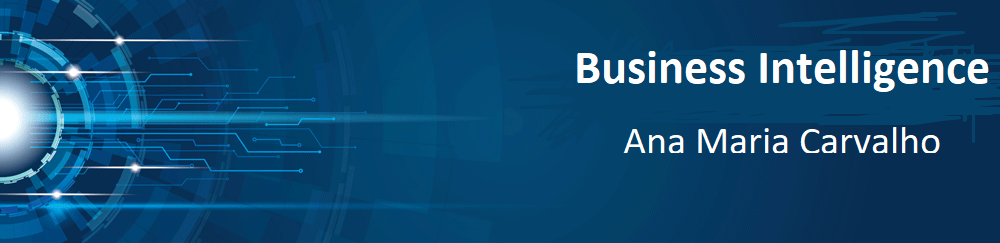

   

  

# Ana Maria Carvalho
*Lead Business Intelligence*

**Background in:** 

**Links:**
* [LinkedIn](https://www.linkedin.com/in/carvalhoanamaria/)
* [Medium](https://www.medium.com)

## Artigos abordando assuntos relacionado a Business Intelligence:
* **Descubra o que é business Intelligence e como sua estrutura é composta:** https://bit.ly/2TxUo2T
## Projetos:
:

